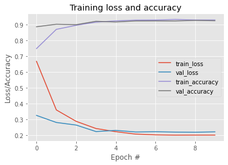
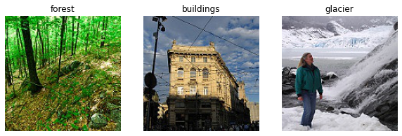
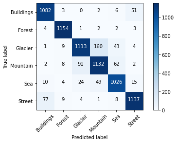

# VGG16-Transfer-Learning
___
## Introduction
### keras
Keras is an open source neural network library written in Python and capable of running on top of either TensorFlow, CNTK or Theano.
- Allows for easy and fast prototyping
- Supports both convolutional networks and recurrent networks, as well as combinations of the two
- Runs seamlessly on CPU and GPU
- Keras is compatible with Python 2.7 and onwards

### Deep Learning
"Deep Learning is the application to learning tasks of artificial neural networks(ANNs) that contain more than one hidden layer. Deep learning is part of Machine Learning methods based on learning data representations. Learning can be supervised, parially supervised or unsupervised."

### Intel Image Classification Dataset
This is image data of Natural Scenes around the world. It contains around 25k images of size 150x150 distributed under 6 categories.
{'buildings' -> 0,
'forest' -> 1,
'glacier' -> 2,
'mountain' -> 3,
'sea' -> 4,
'street' -> 5 }

The Train, Test and Prediction data is separated in each zip files. It can be downloaded from [kaggle](https://www.kaggle.com/puneet6060/intel-image-classification).

## Required Libraries
- os
- keras 
- matplotlib 
- numpy 
- sklearn 
- itertools

## Project structure
\images - folder for images in README.md
VGG16_transfer_learning.ipynb - VGG16 training file
README.md - description of this project

## VGG Model
The VGG16 model used is shown below
```
Model: "model"
_________________________________________________________________
Layer (type)                 Output Shape              Param #   
=================================================================
input_1 (InputLayer)         [(None, 150, 150, 3)]     0         
_________________________________________________________________
block1_conv1 (Conv2D)        (None, 150, 150, 64)      1792      
_________________________________________________________________
block1_conv2 (Conv2D)        (None, 150, 150, 64)      36928     
_________________________________________________________________
block1_pool (MaxPooling2D)   (None, 75, 75, 64)        0         
_________________________________________________________________
block2_conv1 (Conv2D)        (None, 75, 75, 128)       73856     
_________________________________________________________________
block2_conv2 (Conv2D)        (None, 75, 75, 128)       147584    
_________________________________________________________________
block2_pool (MaxPooling2D)   (None, 37, 37, 128)       0         
_________________________________________________________________
block3_conv1 (Conv2D)        (None, 37, 37, 256)       295168    
_________________________________________________________________
block3_conv2 (Conv2D)        (None, 37, 37, 256)       590080    
_________________________________________________________________
block3_conv3 (Conv2D)        (None, 37, 37, 256)       590080    
_________________________________________________________________
block3_pool (MaxPooling2D)   (None, 18, 18, 256)       0         
_________________________________________________________________
block4_conv1 (Conv2D)        (None, 18, 18, 512)       1180160   
_________________________________________________________________
block4_conv2 (Conv2D)        (None, 18, 18, 512)       2359808   
_________________________________________________________________
block4_conv3 (Conv2D)        (None, 18, 18, 512)       2359808   
_________________________________________________________________
block4_pool (MaxPooling2D)   (None, 9, 9, 512)         0         
_________________________________________________________________
block5_conv1 (Conv2D)        (None, 9, 9, 512)         2359808   
_________________________________________________________________
block5_conv2 (Conv2D)        (None, 9, 9, 512)         2359808   
_________________________________________________________________
block5_conv3 (Conv2D)        (None, 9, 9, 512)         2359808   
_________________________________________________________________
block5_pool (MaxPooling2D)   (None, 4, 4, 512)         0         
_________________________________________________________________
flatten (Flatten)            (None, 8192)              0         
_________________________________________________________________
dense (Dense)                (None, 1024)              8389632   
_________________________________________________________________
dense_1 (Dense)              (None, 6)                 6150      
=================================================================
Total params: 23,110,470
Trainable params: 23,110,470
Non-trainable params: 0
_________________________________________________________________
```

## Usage
### Data Preprocessing
``` 
train_datagen = ImageDataGenerator(
    rescale = 1./255,
    rotation_range=40,
    width_shift_range=0.2,
    shear_range=0.2,
    zoom_range=0.2,
    horizontal_flip=True,
    fill_mode='nearest',
)

valid_datagen = ImageDataGenerator(
    rescale = 1./255,
)

pred_datagen = ImageDataGenerator(
    rescale = 1./255,
)
```
### Train model
```
model.compile(loss='categorical_crossentropy', optimizer=sgd,metrics=['accuracy'])
```
### Fit model
```
vgg16_clf = model.fit(train_dataset, validation_data = test_dataset, epochs = 10, callbacks=[cb_checkpointer, learning_rate_reduction])
```
## Weights
The trained Weights can be downloaded from [here](https://drive.google.com/file/d/17ZZ8VP63ua4N0rdx4CRgKBfOJCs_-rKP/view?usp=sharing).
## Results
After testing different otimizers, learning rates and batch sizes. The following parametes gave better results.
- learning rate = 0.001
- momentum = 0.9
- optimizer = SGD
- batch size = 128

Accuracy of 91% is achieved on intel image classification dataset.

### Predictions 
Predictions on some test images can be seen below



### Confusion Matrix


### References
- [Very Deep Convolutional Networks for Large-Scale Image Recognition](https://arxiv.org/abs/1409.1556)
